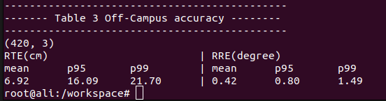
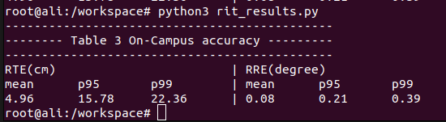

# VRF: Vehicle Road-side Point Cloud Fusion

# Table of Contents
- [Setup](#setup)
- [Build Instructions](#build-instructions)
- [Dataset](#dataset)
- [Run Instructions](#run-instructions)
  
## Setup
For this project, we will use a Docker container to containerize our code.

### Pre-requisties
This document assumes that you already have [Docker](https://docs.docker.com/engine/install/ubuntu/) and [NVIDIA-Docker](https://docs.nvidia.com/datacenter/cloud-native/container-toolkit/install-guide.html) installed on your machine. 

### Docker Setup
Download the docker container for this project as follows:

```
docker pull alikhalid3110/ros_essentials:latest
```

To check if you have pulled the docker, run the following:

```
docker images
```

This should output all the dockers you have on your machine and it should contain ```alikhalid3110/ros_essentials:latest```. Now, that you have the docker, you can run it on your machine. We have a [script](run_vrf_docker.bash) for this which will let you mount folders (volumes) to the docker as well. It also sets up different parameters so that you can use GUI programs from within the docker. To use this script, you need to do the following. Open the [run_vrf_docker.bash](run_vrf_docker.bash) file and change lines 4 and 5 to reflect paths to where you keep your datasets and codebases. As you can see, I keep datasets in ```/home/ali/dataset/``` and my VRF code in ```/home/ali/workspace/VRF``. After you have made these changes, simply run the script to fire up the docker.

```
bash run_edge_assist_docker.bash
```

This will fire up the docker and you can interact with it using the current terminal window. If you want to attach another terminal to it, open a new terminal and type the following

```
docker exec -it vrf bash
```

This will open another terminal within the same docker.

If you are curious about the docker, it contains ROS (Robot Operating System), PCL (Point Cloud Library), ColMap and some of their dependencies.


## Build Instructions
This section explains how you can build the code that this repository contains. Again, the assumption is that you are running the ```alikhalid3110/ros_essentials:latest``` docker when you run the following commands. This repository uses the ROS build system (```catkin_make```). To build all the above modules, simply do the following.

1. First, run the ROS master. To do this, run  the following:

```
roscore &
```

2. After the output stops, press enter and you'll be back to the terminal. With that, we can now build all the tools mentioned above as.

```
cd /workspace/catkin_ws/
catkin_make
```

```catkin_make``` is the ROS build tool. It will build all tools in ```catkin_ws/src```.

## Dataset
Download the three datasets (carla, usc_data_accuracy, rit_data_accuracy) from this [link](https://drive.google.com/drive/folders/1fstbvPEIsZocvqDT081GufHS9PY8pwoH?usp=sharing), unzip them, and place in the dataset directory that you have mounted with docker container. A brief descriptoin of datasets is provided below:
1. **carla:** <br>
This dataset consist of three different datasets (Dataset_1, Dataset_2,Dataset_3), collected in varying traffic conditions. Each dataset further consists of five datasets (D1-D5).
2. **usc_data_accuracy** <br>
This dataset is refered in the paper as off-campus dataset and is a collection of five datasets (D1-D5).
3. **rit_data_accurcay** <br>
This dataset is refered in the paper as on-campus dataset and is a collection of six datasets (D1-D6).

## RUN Instructions
This section explains how to run the code and reproduce accuracy results mentioned in Table#3 and Table#9 in the paper. 

1. Download the datasets as explained [here](#dataset).
2. Open five teminals and run docker in all of them as explained in [docker setup](#docker-setup). After that run the following command in all the terminals:
```
cd workspace/carkin_ws
```
4. Run the ROS master. To do this, run the following command in any of the terminal:

```
roscore &
```
After the output stops, press enter and you'll be back to the terminal. 
4. Modify [setup_env.bash](catkin_ws/setup_env.bash) as explained [here](#setup-environment) for each dataset and then run the following commands: <br> 
**Terminal#1** 
```
source setup_env.bash
rosrun fast_gicp infra_3
```
**Terminal#2**
```
source setup_env.bash
rosrun fast_gicp vehicle_ndt_5
```
**Terminal#3**
```
source setup_env.bash
rosrun fast_gicp vehicle_fusion_5
```
**Terminal#4**
```
source setup_env.bash
rosrun ./vehicle
```
**Terminal#5**
```
source setup_env.bash
rosrun ./infra
```
5. Now press space to play bag in vehicle bag in terminal#4 and then in terminal#5 to play infrastructure(rsu) bag.
6. After the bags are stoped, stop process in the first 3  terminals using 'Ctrl+C'.
7. Update setup_env.bash and repeat the process for other dataset.
8. After you are finished executing the code for all the datasets, run the python scripts (as shown below) to calculate and print the results. The output of each python script is also shown below:
   ```
   python3 carla_results.py
   ```
   
   ```
   python3 usc_results.py
   ```
   
   ```
   python3 rit_results.py 
   ```
   

## Setup Environment
In this section, we will explain how to configure [setup_env.bash](catkin_ws/setup_env.bash) for different datasets. You have to modify lines 12-17 for each dataset before running VRF.
- ### **carla** 
  Modify the file as follow<br>
  
  - **line#12:** 
    ```
    rosparam set /data_mode carla
    ```
  
  - **line#15-16:**  <br>
    Modify ```dataset_path``` and ```dataset_name`` lines according to the name of dataset. For Dataset_1(D1) it will look like this:
    ```
    dataset_path="/dataset/Dataset_1"
    dataset_name="D1"
    ```
  
  - **line#17:**  <br>
    Modify this line according to dataset_name value. <br>
  
    - **For D1:**
      ```
      append="f" # true(t) or false(f)
      ```
    - **For D2-D5:**
      ```
      append="t" # true(t) or false(f)
      ```
  #### Note
  For each dataset in carla, you have to run vrf in order. For examle for Dataset_1 run vrf for D1 first, then D2, and so on to D5. 
- ### rit_data_accuracy
  The setup_env.bash file for rit data will look like this:
   ```
  rosparam set /data_mode rit
  dataset_path="/dataset/rit_data_accuracy"
  dataset_name="D1"
  append="f" # true(t) or false(f)
  ```
   Change ```dataset_name``` (D1-D6) to reflect the dataset for which you are running VRF. 
  
- ### usc_data_accuracy
  The setup_env.bash file for rit data will look like this:
   ```
  rosparam set /data_mode usc
  dataset_path="/dataset/usc_data_accuracy"
  dataset_name="D1"
  append="f" # true(t) or false(f)
  ```
  Change ```dataset_name``` (D1-D5) to reflect the dataset for which you are running VRF. 
